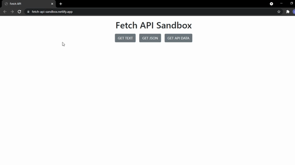
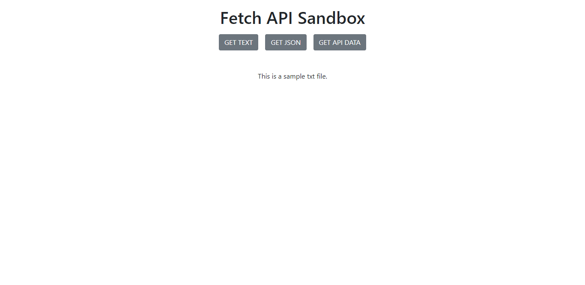
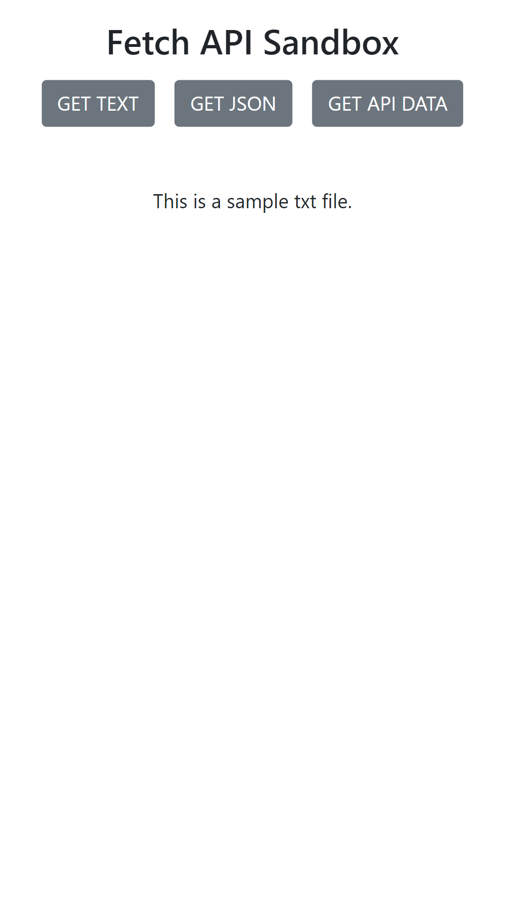

# FetchAPISandbox
Testing Fetch API on local text &amp; JSON files and external API(JSONPlaceholder)

## Features
- Fetch Data on text file(async)
- Fetch Data from JSON file(async)
-  Fetch Data from external API(async)
- Validation and success messages

### Preview

   
  

### Screenshot

            This is a desktop View.

             This is for mobile view.

   
  

  
### Links

- [Live Site URL](https://albert-book-list.netlify.app/)
- [Youtube]

### Built with

- Semantic HTML5 markup
- Bootstrap 5
- Vanilla JS(Fetch API, Promises, Arrow Functions...)

## Author

- [Instagram](https://www.instagram.com/albert_sigsbert/)
- [LinkedIn](https://www.linkedin.com/in/albertsigsbert/)
- [Twitter](https://twitter.com/albert_sigsbert)
